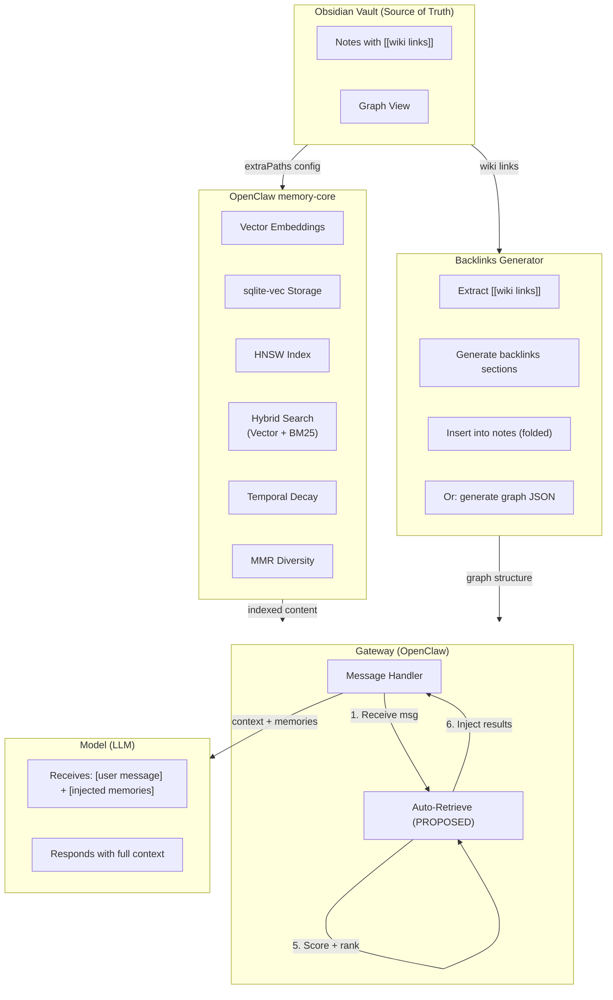

# Technical Architecture

## System Overview



## Components

### 1. Obsidian Vault

- **Role:** Source of truth for knowledge
- **Format:** Markdown files with `[[wiki links]]`
- **Interface:** Obsidian (unchanged)
- **Modification:** None (read-only for OpenClaw)

### 2. OpenClaw memory-core

- **Role:** Vector search engine
- **Storage:** SQLite + sqlite-vec extension
- **Features:** HNSW index, hybrid search, temporal decay, MMR
- **Config:** `extraPaths` pointing to Obsidian vault

### 3. Backlinks Generator

- **Role:** Parse wiki links into graph structure
- **Output:** Backlinks sections in notes OR graph JSON
- **Schedule:** Nightly cron or on-change watcher
- **Language:** Python

### 4. Auto-Retrieve (PROPOSED)

- **Role:** Automatic memory injection
- **Location:** Gateway message processing pipeline
- **Behavior:** Intercepts user messages, runs search, injects results
- **Config:** `memorySearch.autoRetrieve`

### 5. Search Script (FALLBACK)

- **Role:** Manual search with graph traversal
- **Location:** OpenClaw skill
- **Behavior:** Called by model, does vector search + graph expansion
- **Language:** Python

## Data Flow

### Normal Flow (No Auto-Retrieve)

```
User message → Gateway → Model → Response
                              ↓
                    Model decides to search
                              ↓
                    memory_search tool call
                              ↓
                    Results returned to model
                              ↓
                    Model generates response
```

### Auto-Retrieve Flow (PROPOSED)

```
User message → Gateway → Auto-retrieve → Inject results → Model → Response
                              ↓
                    Vector search (automatic)
                              ↓
                    Top 3 results
                              ↓
                    Format as system message
                              ↓
                    Inject into context
```

### Graph Traversal Flow (WITH AUTO-RETRIEVE)

```
User message → Gateway → Auto-retrieve → Graph expansion → Inject → Model → Response
                              ↓                    ↓
                    Vector search          Follow wiki links
                              ↓                    ↓
                    Top 5 results         Expand to connected notes
                              ↓                    ↓
                    Initial set           Scored + ranked set
```

## Storage

### SQLite Schema

```sql
-- Vector embeddings (existing in OpenClaw)
CREATE TABLE vec_embeddings (
    chunk_id INTEGER PRIMARY KEY,
    note_id INTEGER,
    chunk_text TEXT,
    embedding BLOB  -- 3072-dim vector
);

-- Vector index (existing)
CREATE INDEX idx_embeddings ON vec_embeddings USING hnsw(embedding);

-- Graph edges (PROPOSED - for explicit graph traversal)
CREATE TABLE graph_edges (
    source_note TEXT,
    target_note TEXT,
    link_type TEXT DEFAULT 'wiki',  -- wiki, backlink, inferred
    weight REAL DEFAULT 1.0,
    created_at TIMESTAMP DEFAULT CURRENT_TIMESTAMP
);

-- Notes metadata (PROPOSED)
CREATE TABLE notes (
    id INTEGER PRIMARY KEY,
    title TEXT UNIQUE,
    path TEXT,
    last_modified TIMESTAMP,
    connection_count INTEGER DEFAULT 0
);
```

### Graph JSON (FALLBACK)

```json
{
  "Auth Design": {
    "path": "architecture/Auth Design.md",
    "links_to": ["JWT Implementation", "API Security"],
    "linked_from": ["Deployment Strategy", "API Architecture"],
    "connection_count": 18
  }
}
```

## Configuration

### OpenClaw memory-core

```json5
{
  "agents": {
    "defaults": {
      "memorySearch": {
        "provider": "openai",
        "model": "text-embedding-3-large",
        "extraPaths": ["/home/cityjohn/Obsidian/Journal/Knowledge"],
        "query": {
          "hybrid": {
            "enabled": true,
            "vectorWeight": 0.7,
            "textWeight": 0.3,
            "mmr": { "enabled": true, "lambda": 0.7 },
            "temporalDecay": { "enabled": true, "halfLifeDays": 90 }
          }
        }
      }
    }
  }
}
```

### Auto-Retrieve (PROPOSED)

```json5
{
  "agents": {
    "defaults": {
      "memorySearch": {
        "autoRetrieve": {
          "enabled": true,
          "maxResults": 3,
          "maxSnippetChars": 500,
          "scope": {
            "default": "deny",
            "rules": [
              { "action": "allow", "match": { "chatType": "direct" } }
            ]
          }
        }
      }
    }
  }
}
```

## Performance

### Vector Search

- **Latency:** ~50-100ms (sqlite-vec HNSW index)
- **Throughput:** ~1000 queries/second
- **Storage:** ~10MB per 1000 notes (3072-dim embeddings)

### Graph Traversal

- **Latency:** ~10-50ms (JSON adjacency list, 2 hops)
- **Throughput:** ~5000 traversals/second
- **Storage:** ~50KB per 1000 notes (graph JSON)

### Auto-Retrieve

- **Overhead:** ~100ms per user message
- **Cost:** ~$0.0002 per query (embedding only)
- **Total per session:** ~$0.006 (30 turns)
